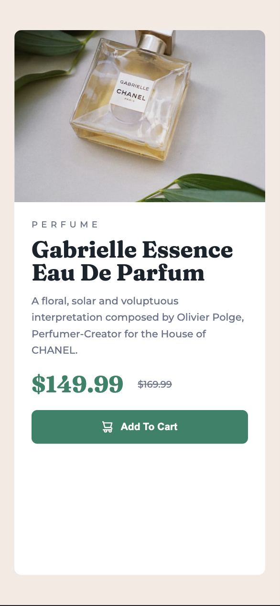

# Frontend Mentor - Product preview card component solution

This is a solution to the [Product preview card component challenge on Frontend Mentor](https://www.frontendmentor.io/challenges/product-preview-card-component-GO7UmttRfa). Frontend Mentor challenges help you improve your coding skills by building realistic projects. 

## Table of contents

- [Overview](#overview)
  - [The challenge](#the-challenge)
  - [Screenshot](#screenshot)
  - [Links](#links)
- [My process](#my-process)
  - [Built with](#built-with)
  - [What I learned](#what-i-learned)
- [Author](#author)

## Overview

### The challenge

Users should be able to:

- View the optimal layout depending on their device's screen size
- See hover and focus states for interactive elements

### Screenshot




### Links

- Solution URL: [Source Code](https://github.com/ritabradley/product-preview-card)
- Live Site URL: [Live Preview](https://rb-product-preview-card.netlify.app/)

## My process

### Built with

- CSS custom properties
- Flexbox
- Mobile-first workflow

### What I learned

I learned a bit more about how to leveage Flexbox to make nice layouts. I struggled a bit with getting the desktop view centered because I used fixed sizing for the card but once I figured that out, it was smooth sailing.


```html
 <div class="product__card">
      <div class="product-preview">
      </div>
      <div class="product__details">
        <h3 class="product__category">Perfume</h3>
        <h1 class="product__name">Gabrielle Essence Eau De Parfum</h1>
        <p class="product__description">A floral, solar and voluptuous interpretation composed by Olivier Polge,
          Perfumer-Creator for the House of CHANEL.</p>
        <div class="product__pricing">
          <p class="product__sale-price">$149.99</p>
          <p class="product__regular-price">$169.99</p>
        </div>
        <button>Add To Cart</button>
      </div>
    </div>
```
I tend to use Sass when I code my CSS to the BEM naming methodology works well for me. I didn't use Sass this time but I try to stay in the habit of using the same naming convention.

```css
:root {
    font-family: 'Montserrat', sans-serif;
    font-weight: 500;
    line-height: 2.3rem;
    --heading-font-family: 'Fraunces', serif;
    --heading-font-weight: 700;
    --heading-size: 3.2rem;
    --secondary-bg: rgb(255, 255, 255);
    --primary-bg: rgb(242, 234, 226);
    --secondary-text: hsl(228, 12%, 48%);
    --primary-text: rgb(28, 35, 43);
    --brand-color: rgb(61, 129, 104);
    --brand-hover-color: rgb(26, 64, 50);
}
```
Using custom properties made styling A LOT easier. I didn't have to repeat a lot of code and it's nice to have a style guide in place.

## Author

- Twitter - [@ritabradley_dev](https://www.twitter.com/ritabradley_dev)

